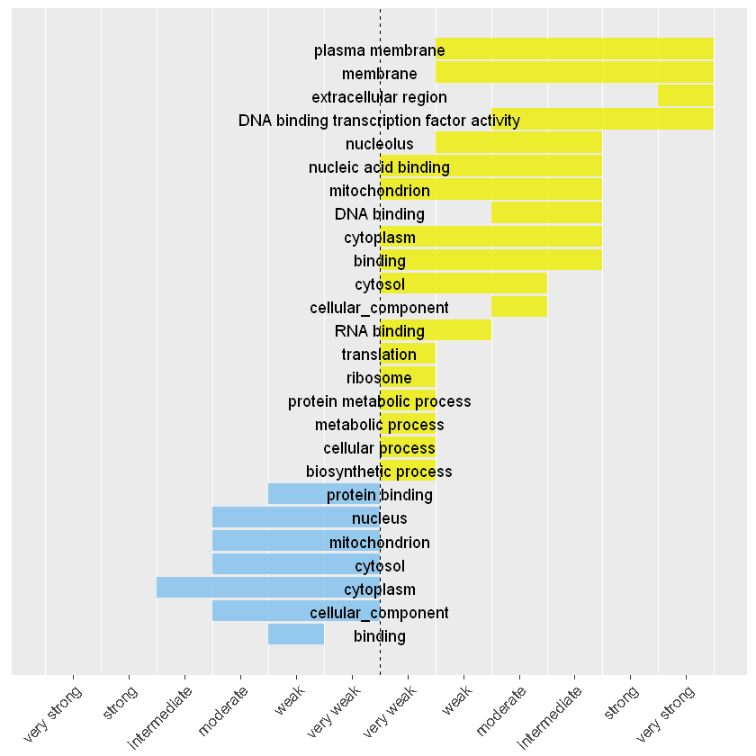
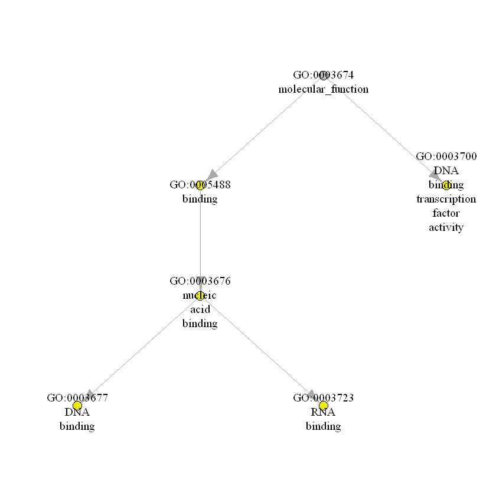

# FSGOR package guide

## Daniil Wiebe

## 2018-01-23

The aim of the package is to provide tools for identification of a set of genes with a similar degree of fold change associated with particular GO term (fold-change specific GO term) (Omelyanchuk et al., 2017). The package works with preprocessed experimental data on differential expression. Below the pipeline for RNA-seq experiment data is presented.

Upload differential expression data as a dataframe. The dataset in the example contains three columns 1) Gene ID 2) log fold-change value 3) p-value 4) adjusted p-value.


```R
exp_path <- system.file("extdata", "rna_seq_example.txt", package = "fsgor")
rna_seq_data <- read.table(exp_path, stringsAsFactors = F, header = T)
```

Extract all genes under study as a vector


```R
bg_genes <- rna_seq_data[, 1]
```

Divide initial dataframe into two with up-regulated and down-regulated differentially expressed genes


```R
rna_seq_data <- rna_seq_data[rna_seq_data[, 4] < 0.05, ]
up_data <- rna_seq_data[rna_seq_data[, 2] > 0, ]
down_data <- rna_seq_data[rna_seq_data[, 2] < 0, ]
```

Divide initial gene set in to intervals. div_genes_to_quantiles function returns list containing resulting intervals and all possible combinations of intervals


```R
up_genes <- div_genes_to_quantiles(up_data, 6)
down_genes <- div_genes_to_quantiles(down_data, 6)
```

Preprocess annotation data


```R
go_path <- system.file("extdata", "goslim_plant.obo", package = "fsgor")
gaf_path <- system.file("extdata", "gene_association.tair", package = "fsgor")
annot_obj <- prepare_annotaion(onto_path = go_path, annot_path = gaf_path)
```

Annotate resulting gene sets using par_multiple_sets_annot function


```R
up_annot <- par_multiple_sets_annot(up_genes, annot_obj, threads = 6, gene_amount_border =  10, background_genes = bg_genes, p_adjust_method =  "BY")
down_annot <- par_multiple_sets_annot(down_genes, annot_obj, threads = 6, gene_amount_border =  10, background_genes = bg_genes, p_adjust_method =  "BY")
```

Identify fold-sepcific GO terms using recognize_fs_terms function


```R
fs_up <- recognize_fs_terms(up_annot, wholeintname = "1-6", listofcolnames = colnameslist, p_adjust_method = "BY", fdr2step = 1, fdr3step = 0.05)
fs_down <- recognize_fs_terms(down_annot, wholeintname = "1-6", listofcolnames = colnameslist, p_adjust_method = "BY", fdr2step = 1, fdr3step = 0.05)
```

Visualize th results in two ways, using fold_spec_chart and fold_spec_graph functions


```R
fs_chart <- fold_spec_chart(fs_up, fs_down,scope = NULL,  six_perc_labs)
```


```R
fs_chart
```





```R
up_graph <- fold_spec_graph(fs_up, annot_obj, reg = "up", scope = "molecular_function")
```


```R
plot(up_graph, asp = 0)
```





## References

Omelyanchuk, N. A., Wiebe, D. S., Novikova D. D., Levitsky, V. G., Klimova, N., Gorelova, V., C. Weinholdt,G. V. Vasiliev, E. V. Zemlyanskaya, N. A. Kolchanov, A. V. Kochetov, I. Grosse,V. V. Mironova. Auxin regulates functional gene groups in a fold-change-specific manner in Arabidopsis thaliana roots. Scientific Reports, 2017, 7 (2489), doi:10.1038/s41598-017-02476-8
